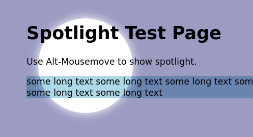

# CSS toolkit

<!--- These are examples. See https://shields.io for others or to customize this set of shields. You might want to include dependencies, project status and licence info here --->


<!---->

CSS toolkit with tips and tricks. 

The toolkit offers CSS examples who helps to style web pages and develop good user experiences. Checkout the CSS spotlight, one of my favorite CSS tricks.



## Installing CSS toolkit

To install CSS toolkit, follow these steps:

All OS
```
git clone https://github.com/mab9/css-toolkit.git
open a css example file within your browser.
```

## Providen examples

- CSSAlmost3D
- CSSAnimatedSignature
- CSSButtonCentering
- CSSCalculatedColors
- CSSCollapse
- CSSFocusEffektRipple
- CSSGlossy-hover
- CSSGlossy
- CSSNavbarIndicator
- CSSRipple
- CSSSpotlight
- CSSTriangle
- CSSValidation
- CSSVisibleFixedHeader


## My next ideas

- add custom property examples
- add website grid layout examples 
- add responsive website examples
- add UX examples 

## Contributors

Thanks to the following people who have contributed to this project:

* [@mab9](https://github.com/mab9) 📖

<!-- You might want to consider using something like the [All Contributors](https://github.com/all-contributors/all-contributors) specification and its [emoji key](https://allcontributors.org/docs/en/emoji-key). -->

## Contact

If you want to contact me you can reach me at **marcantoine.bruelhart@gmail.com.**

## License
<!--- If you're not sure which open license to use see https://choosealicense.com/--->

This project uses the following license: [GNU GPLv3](https://choosealicense.com/licenses/gpl-3.0/).
